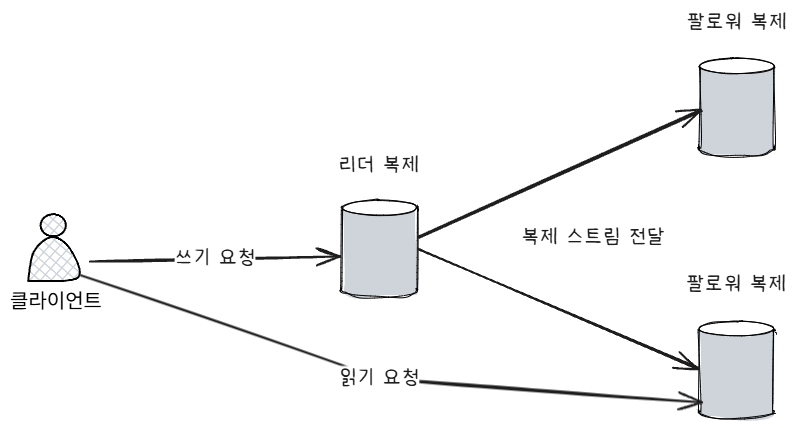
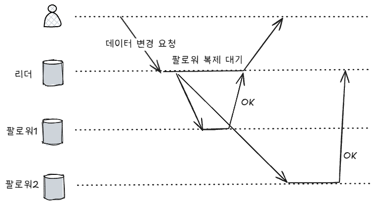

# 05장 복제

복제: 네트워크로 연결된 여러 장비에 동일한 데이터의 복사본을 유지
- 지리적 이점
- 장애 가용성
- 읽기 처리량

복제의 어려움은 데이터가 변경이 된다는 점이다. 이를 해결하기 위한 방법에는 여러 방안이 있으면 중요한 것은 trade-off를 고려하는 것이다.

## 리더와 팔로워
***
- 복제 서버: 데이터베이스의 복사본을 저장하는 각 노드.
1. 복제 서버 중 하나를 리더로 선정한다.
2. 리더는 클라이언트의 모든 쓰기 요청을 처리한다.
3. 리더의 로컬에 데이터를 저장하고 팔로워에게 이를 전달한다. 
    - 복제 로그
    - 변경 스트림
4. 팔로워는 리더로부터 받은 로그를 바탕으로 그대로 쓰기를 진행한다.

리더 팔로워는 데이터베이스뿐만 아니라 메시지 브로커나 다른 컴포넌트에도 사용될 수 있다.

### 동기식 대 비동기식 복제
- 동기식: 리더가 팔로워의 복제 확인 응답을 받은 후에 클라이언트에게 응답
- 비동기식: 리더가 팔로워 복제 확인 응답 여부와 상관없이 클라이언트에게 응답

위의 그림에서 리더는 팔로워1에 대한 동기식 복제를 진행하고 있고, 팔로워2에 대해서는 비동기식 복제를 진행하고 있다.

동기식 복제에서는 리더와 팔로워의 데이터 일관성을 보장할 수 있다. 기본적으로 팔로워의 응답을 기다리기 때문에 느리다. 만약
팔로워가 복제 중에 다운되면 다시 복구될 때까지 기다려야 한다.

이러한 특성 때문에 모든 팔로워에 대한 동기식 복제를 쓸 수는 없고, 섞어 쓰는 반동기식 복제를 사용하기도 한다.

비동기식 복제는 빠른 응답을 내릴 수 있다는 장점이 있지만, 리더에 장애가 발생하면 팔로워에 복제되지 않은 데이터는 유실된다. 반면,
팔로워에 장애가 생겨도 리더는 계속 작업을 할 수 있다는 장점이 있다.

### 새로운 팔로워 설정
새로운 팔로워 노드를 추가할 때 단순 리더의 데이터를 복제하면 그 사이 데이터가 변경되면 리더와 팔로워가 다른 곳을 바라볼 수 있다. 아래처럼
하면 시스템의 중단 없이 추가할 수 있다.
1. 리더의 스냅샷을 일정 시점에 찍는다.
2. 스냅샷을 새 팔로워에 적용한다.
3. 새 팔로워는 리더에 다시 스냅샷 이후 데이터들을 요청한다.
4. 새 팔로워는 미처리분을 모두 처리하면 준비됐다고 말하고 합류한다.

## 노드 중단 처리
***

### 팔로워 장애: 따라잡기 복구
각 팔로워는 데이터 변경 로그를 로컬 디스크에 보관한다.
1. 보관된 로그에서 결함이 발생하기 전에 처리한 마지막 트랜잭션을 파악한다.
2. 리더에서 끊어진 동안 발생한 변경 모두 요청해서 처리한다.

### 리더 장애: 장애 복구
리더가 장애걸리면, **장애 복구** 과정을 거쳐야 한다.
- 장애 복구 failover: 팔로워 중 하나를 리더로 승격
1. 리더의 장애 판단: 대개 타임아웃을 활용해 장애를 판단한다.
2. 새로운 리더 선출: 선출 과정 또는 제어 노드를 통해 리더를 선출 한다.
   - 합의 과정
   - 보통 가장 최신의 데이터를 가지고 있는 팔로워를 승격한다.
3. 시스템 재설정: 클라이언트가 쓰기 요청을 새로운 리더에게 보낼 수 있도록 재설정한다. 

장애 복구는 다음과 같은 문제가 있을 수 있다.
- 비동기식 복제: 이전 리더가 실패하기 전 쓰기가 새로운 리더에 적용이 안될 수 있다. 
  - 보통 이전 데이터를 폐기한다고 한다.
  - 근데 외부 시스템과 연결되어 있다고 한다면 조심해야 한다. auto-increment를 사용하면 옜날 키들이 재사용되서 증가되기 때문에
  외부 시스템과 중복된 키가 사용될 수 있다.
- 스플릿 브레인: 두 리더가 생기는 문제. -> 데이터 충돌 발생
- 리더의 장애 판단에 쓰이는 적절한 타임아웃 선정 문제

## 복제 로그 구현
***
리더 기반 복제의 내부적 구현 방법

### 구문 기반 복제
리더가 모든 쓰기 요청 구문(INSERT, UPDATE, DELETE)을 팔로워에게 보낸다.
팔로워는 이걸 받고 파싱해서 복제한다. 근데 다음과 같은 문제가 있다.
- NOW(), RAND()같은 비결정적 함수가 서버마다 다른 값을 줄 수 있다.
- auto-increment를 사용하면 각각의 서버에서 정확히 같은 순서로 실행하지 않으면 달라질 수 있다.
- 부수 효과

### 쓰기 전 로그 배송
모든 쓰기는 기본적으로 로그에 저장한다.
- 로그 구조화 저장소 엔진
- 개별 디스크 블록에 덮어쓰는 B 트리 -> WAL (Write-ahead log)

로그의 단점도 존재한다. 로그는 저수준의 데이터를 기술한다.
- WAL에서는 어떤 디스크 블록에서 어떤 바이트를 변경했는지와 같은 상세 정보를 포함한다.
 
=> 이말은 리더와 팔로워의 데이터베이스 소프트웨어 버전이 동일해야 한다.

이때는 팔로워를 먼저 업그레이드시키고, 그 다음 리더를 업그레이드 시킨다. 만약 WAL의 복제 프로토콜이 불일치를 허용하지 않으면 중단은 불가피하다.

### 논리적(로우 기반) 로그 복제
복제 로그를 저장소 엔진 내부와 분리시키는 방법은 각각 다른 로그를 사용하면 된다. -> 물리적, 논리적 로그
- 저장소 엔진과의 결합을 느슨하게
- 애플리케이션 파싱 용이
- 삽입된 로우 -> 모든 칼럼의 새로운 값 포함
- 삭제된 로우 -> 로우를 고유하게 식별하는 데 필요한 정보
- 갱신된 로우 -> 로우를 고유하게 식별하는 데 필요한 정보, 모든 칼럼의 새로운 값